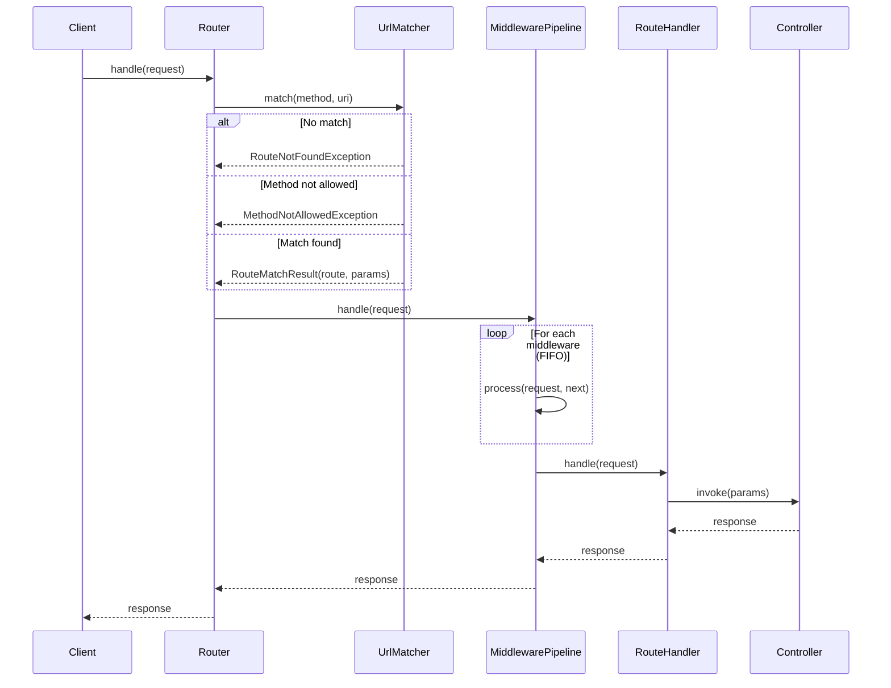
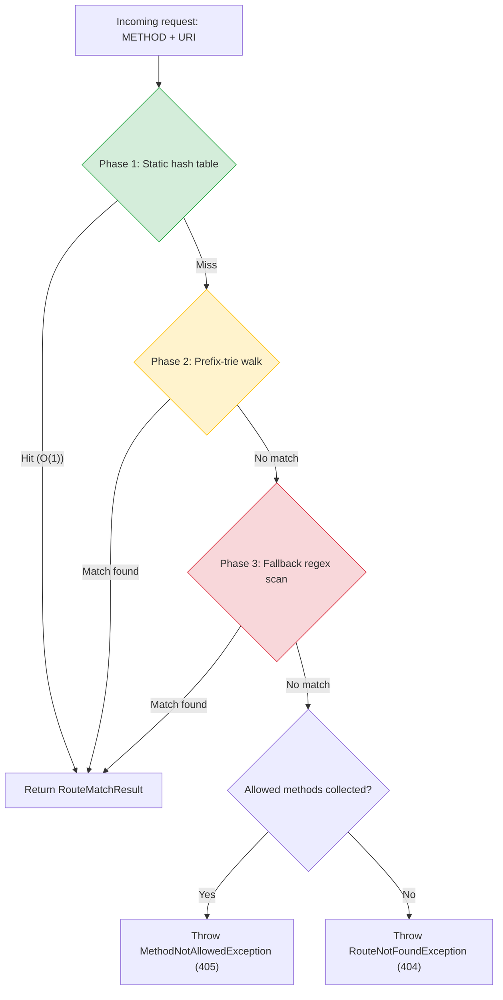
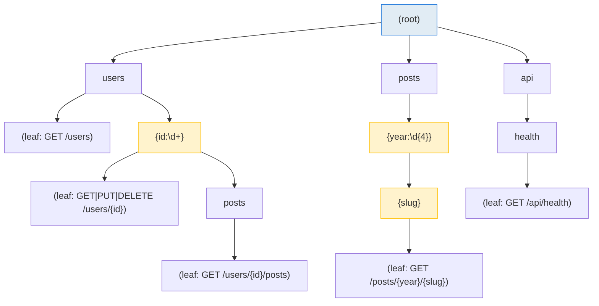
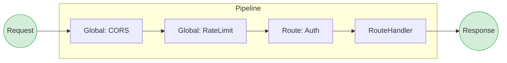
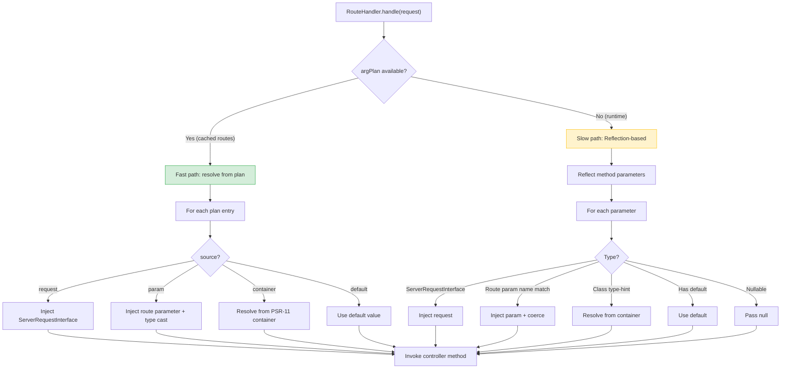
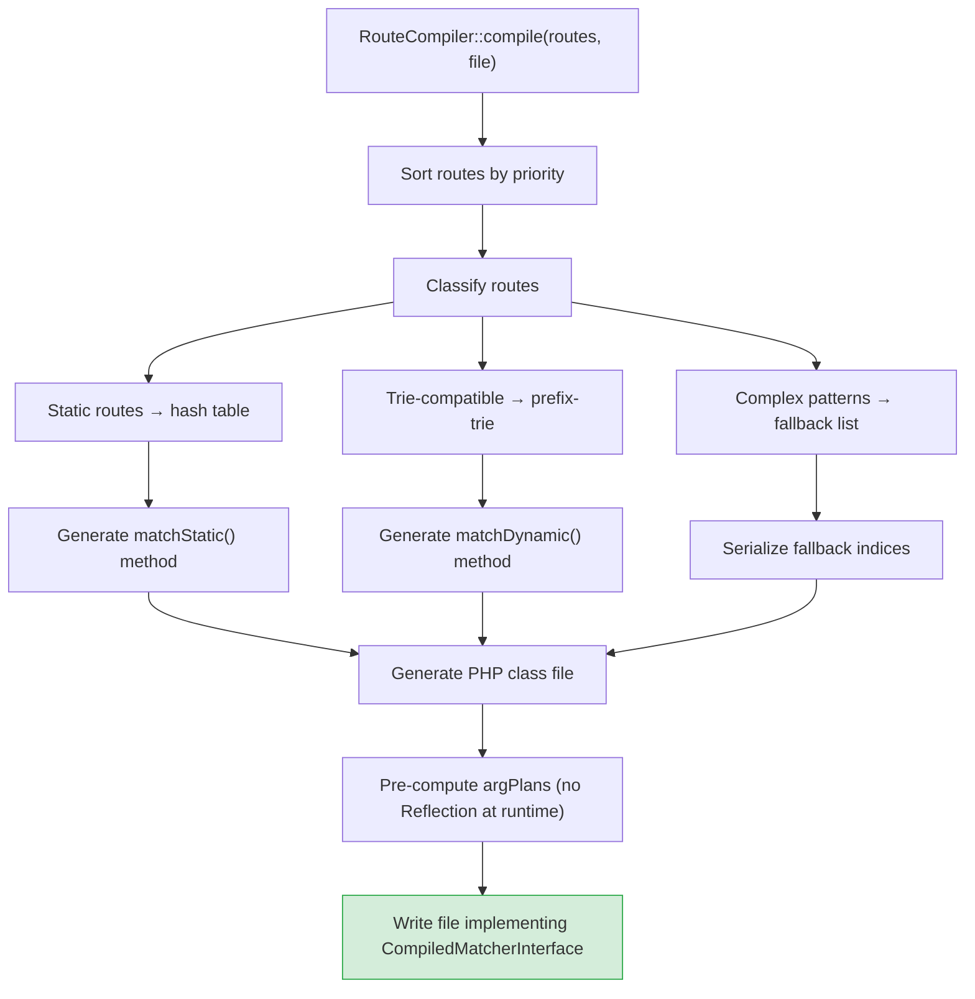
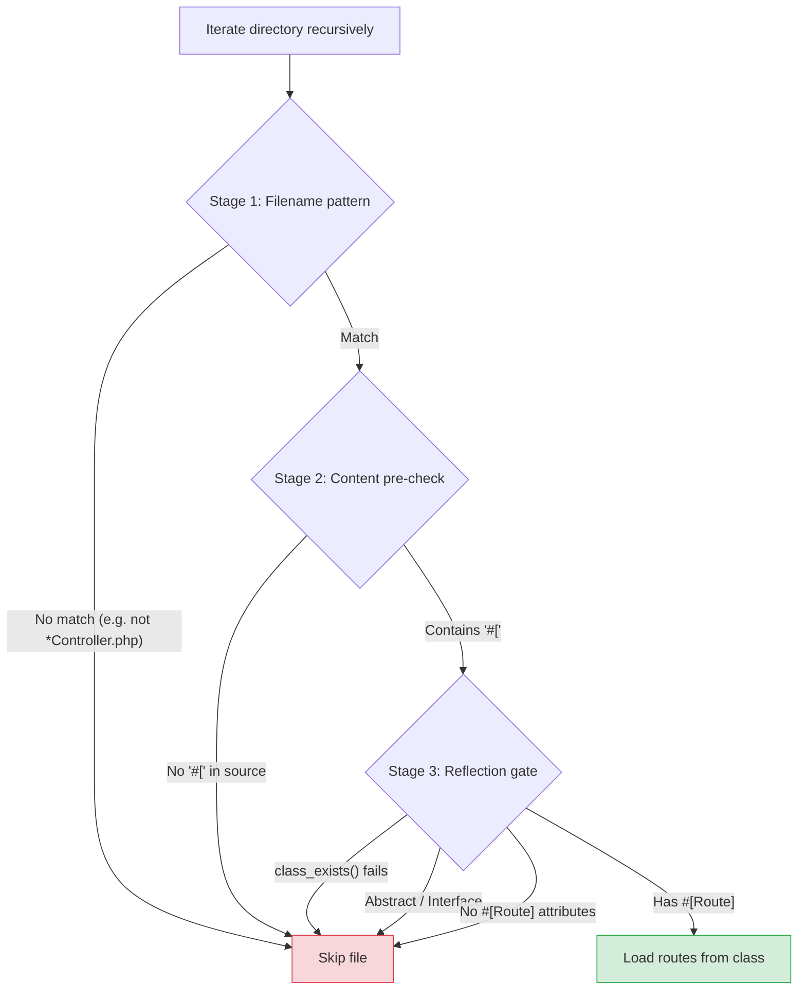
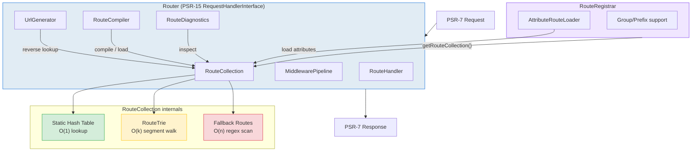

# Internals
{: .no_toc }

Algorithms, data structures, and internal architecture of Waypoint.
{: .fs-6 .fw-300 }

<details open markdown="block">
  <summary>Table of contents</summary>
  {: .text-delta }
- TOC
{:toc}
</details>

---

## Request Lifecycle

When `Router::handle()` is called with an incoming PSR-7 request, the following sequence takes place:



1. **Route matching** — `UrlMatcherInterface::match()` finds a matching route for the HTTP method and URI.
2. **Middleware pipeline** — global and route-level middleware execute in FIFO order.
3. **Controller invocation** — `RouteHandler` resolves parameters via DI and calls the controller.
4. **Response** — the response bubbles back up through the middleware stack.

---

## Route Matching: Three-Phase Strategy

Waypoint uses a three-phase matching strategy, going from fastest to slowest. Each phase is tried in order; as soon as a match is found, the search stops.



### Phase 1: Static Hash Table — O(1)

Routes without parameter placeholders (e.g. `/about`, `/api/health`) are stored in a hash table keyed by `"METHOD:/path"`. This provides constant-time lookup for the most common case.

```
GET:/about        → Route(pattern="/about", ...)
GET:/api/health   → Route(pattern="/api/health", ...)
POST:/api/users   → Route(pattern="/api/users", ...)
```

### Phase 2: Prefix-Trie — O(k) where k = segment count

Routes with parameters (e.g. `/users/{id}`) are stored in a prefix-trie (also known as a segment tree). The trie is walked segment by segment, with O(1) hash lookups for static segments and regex matching only for dynamic segments.

### Phase 3: Fallback Regex Scan — O(n)

Routes with patterns that cannot be represented in the trie (e.g. mixed segments like `prefix-{name}.txt` or cross-segment captures) fall back to linear regex matching. These routes are grouped by their first URI segment for prefix-based filtering, reducing the number of regex tests.

---

## Prefix-Trie Algorithm

The `RouteTrie` is a tree where each node represents a single URI segment. Children are organized as a hash map (static segments) plus an ordered list (dynamic segments).



### Trie Walk Algorithm

```
function match(method, segments, depth, params, allowedMethods):
    if depth == len(segments):
        // Reached the end — check leaf routes
        for each leaf route at this node:
            if route.allowsMethod(method):
                return {route, params}
            else:
                collect allowedMethods
        return null

    segment = segments[depth]

    // 1. Try static children first (O(1) hash lookup)
    if staticChildren[segment] exists:
        result = staticChildren[segment].match(method, segments, depth+1, params, allowedMethods)
        if result != null:
            return result

    // 2. Try dynamic children (regex match per segment)
    for each dynamicChild:
        if dynamicChild.regex matches segment:
            params[dynamicChild.name] = segment
            result = dynamicChild.match(method, segments, depth+1, params, allowedMethods)
            if result != null:
                return result

    return null
```

**Key properties:**
- Static segments are resolved via O(1) hash-map lookup — no regex at all.
- Dynamic segments are tested only when static lookup fails.
- The trie naturally handles priority: routes are inserted in priority order, and the first match wins.
- The algorithm is depth-first — it fully explores each branch before backtracking.

### Trie Serialization (OPcache)

When routes are compiled via `RouteCompiler`, the trie is serialized using **integer-indexed tuples** instead of string-keyed associative arrays. This produces packed arrays that are stored more efficiently in OPcache shared memory.

HTTP methods at leaf nodes are stored as **hash-maps** (`['GET' => true, 'POST' => true]`) at compile time, enabling O(1) `isset()` checks instead of O(n) `in_array()` during the generated `walk()`.

---

## Middleware Pipeline

The `MiddlewarePipeline` implements PSR-15 `RequestHandlerInterface` and uses index-based iteration (no cloning):



### Pipeline Algorithm

```
class MiddlewarePipeline:
    middlewares: list
    handler: RequestHandlerInterface  // final handler (RouteHandler)
    index: int = 0

    function handle(request):
        if index >= len(middlewares):
            return handler.handle(request)  // invoke controller

        middleware = resolve(middlewares[index])
        index++
        try:
            return middleware.process(request, this)
        finally:
            index--  // restore for reusability
```

**Key properties:**
- **FIFO order** — middleware executes in registration order.
- **Index-based** — avoids cloning the pipeline object for each middleware call.
- **`finally` block** — ensures the index is restored after exceptions or short-circuits, making the pipeline reusable.
- **Lazy resolution** — middleware class names are resolved from the PSR-11 container only when needed; resolved instances are cached.

---

## Dependency Injection: Parameter Resolution

The `RouteHandler` resolves controller method parameters using two strategies:



**Fast path (cached):** The `RouteCompiler` pre-computes an argument resolution plan for each route handler. At runtime, the plan is a simple array of `{source, name, cast, ...}` entries — no Reflection needed.

**Slow path (runtime):** When no plan is available (e.g. closure handlers, non-cached routes), `RouteHandler` uses PHP Reflection to inspect method parameters and resolve them dynamically.

### Type Coercion

Route parameters (extracted as strings from the URI) are automatically cast to the declared scalar type:

| Declared type | Coercion |
|:-------------|:---------|
| `int` | `(int) $value` |
| `float` | `(float) $value` |
| `bool` | `filter_var($value, FILTER_VALIDATE_BOOLEAN)` |
| `string` | No coercion (passthrough) |

---

## Route Caching: Compilation Pipeline

The `RouteCompiler` transforms the runtime route collection into an optimized PHP class file:



The generated class implements `CompiledMatcherInterface` with these key methods:

| Method | Purpose |
|:-------|:--------|
| `matchStatic($method, $uri)` | O(1) lookup via PHP `match` expression |
| `matchDynamic($method, $uri, &$allowed)` | Generated trie-traversal code |
| `staticMethods($uri)` | Collect allowed methods for static routes |
| `isStaticOnly($uri)` | Check if URI has only static routes (early 405) |
| `findByName($name)` | O(1) name → route index lookup |
| `getRoute($index)` | Retrieve route data by index |
| `getRouteCount()` | Total number of compiled routes |
| `getFallbackIndices()` | Indices of non-trie-compatible routes |

**Key optimizations:**
- **OPcache-friendly** — the file is a plain PHP class stored in shared memory.
- **Integer-indexed tuples** — trie nodes use packed integer-indexed arrays instead of string-keyed associative arrays, reducing memory footprint in shared memory.
- **Pre-computed method hash-maps** — HTTP methods stored as `['GET' => true]` hash-maps at compile time, enabling O(1) `isset()` checks instead of O(n) `in_array()`.
- **No Reflection** — argument resolution plans are pre-computed at compile time.
- **Lazy hydration** — `Route` objects are constructed only for matched routes, not all routes.
- **Match expressions** — PHP 8 `match` is used for static route dispatch (compiled to a hash table by the engine).

---

## Directory Scanning: Three-Stage Filter

The `AttributeRouteLoader::loadFromDirectory()` uses a three-stage filter to minimize expensive operations:



| Stage | Cost | What it filters |
|:------|:-----|:----------------|
| **Filename pattern** | Very low (string match) | Files not matching the glob (e.g. `*Controller.php`) |
| **Content pre-check** | Low (file read + `str_contains`) | Files without any PHP attribute syntax (`#[`) |
| **Reflection gate** | High (autoload + reflection) | Abstract classes, interfaces, classes without `#[Route]` |

Each stage is cheaper than the next. Most files are filtered in stages 1-2, so expensive autoloading and reflection only happen for files that are likely to contain routes.

---

## Architecture Overview



| Component | Responsibility |
|:----------|:---------------|
| **RouteRegistrar** | Fluent route registration, attribute loading, group prefixes and middleware |
| **Router** | PSR-15 request handler — matching, middleware execution, dispatching |
| **RouteCollection** | Stores routes, performs matching via three-phase strategy |
| **RouteTrie** | Prefix-tree for fast segment-by-segment matching |
| **AttributeRouteLoader** | Reads `#[Route]` attributes via Reflection |
| **MiddlewarePipeline** | Executes PSR-15 middleware in FIFO order |
| **RouteHandler** | Invokes controller methods with DI-resolved parameters |
| **UrlGenerator** | Reverse routing — generates URLs from named routes |
| **RouteCompiler** | Compiles routes to PHP class for OPcache |
| **RouteDiagnostics** | Detects conflicts and generates reports |
