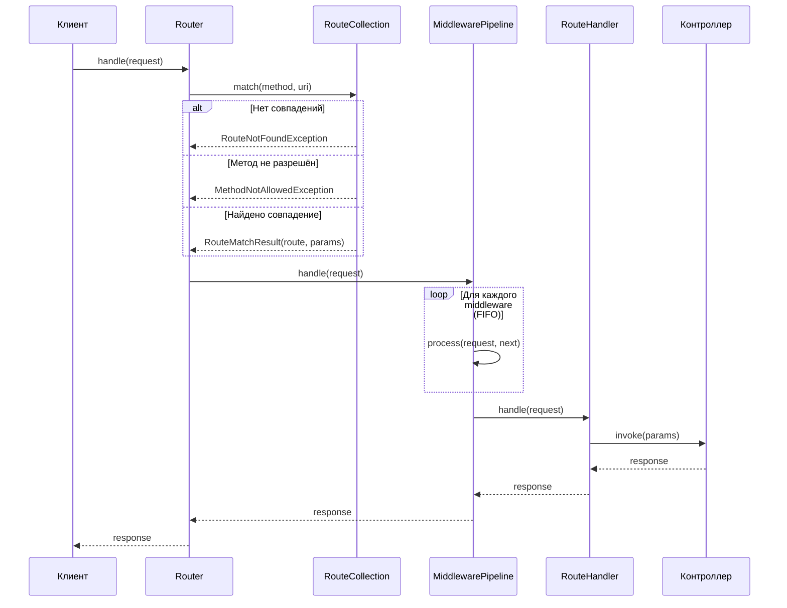
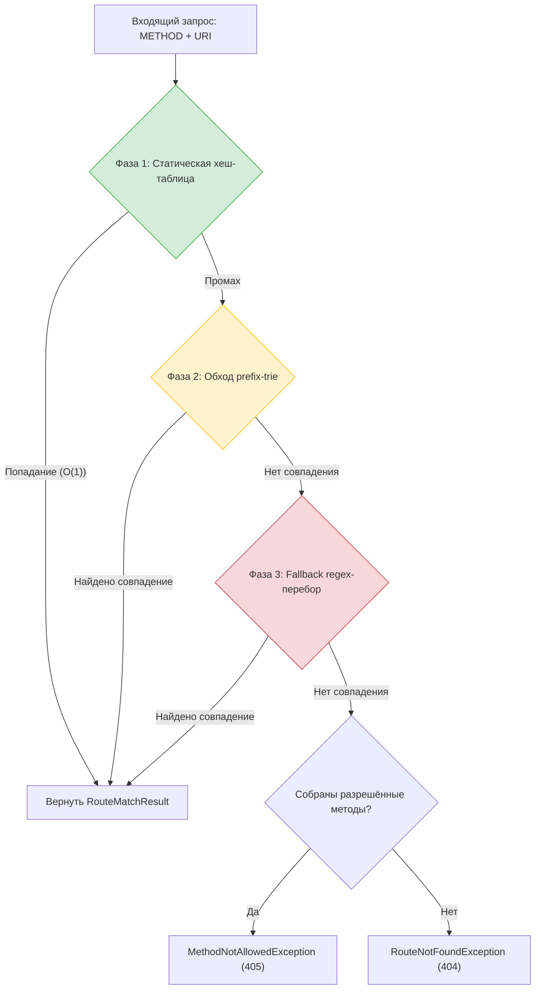
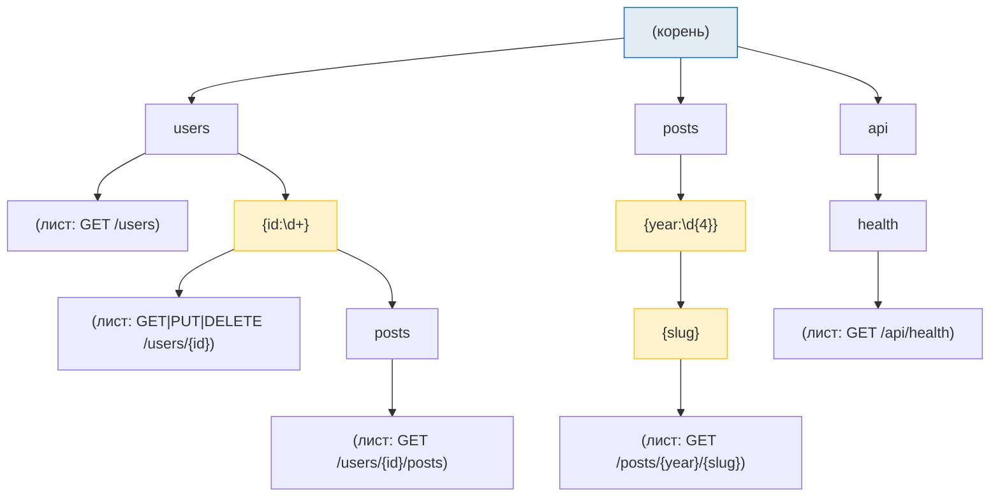
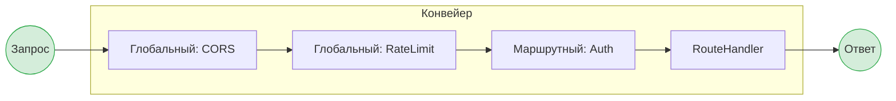
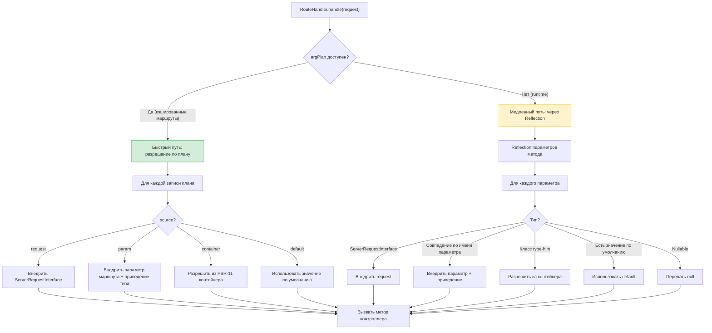
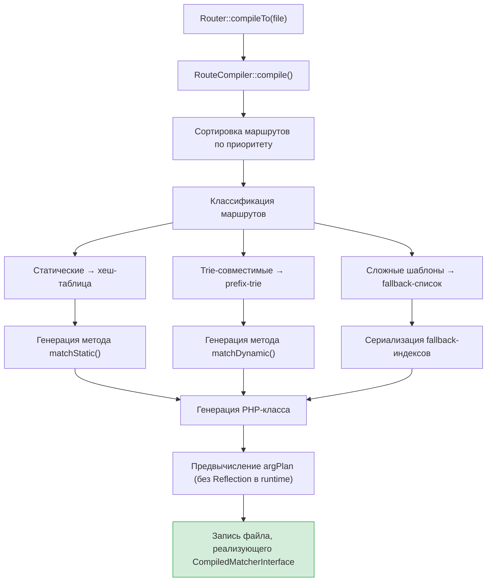
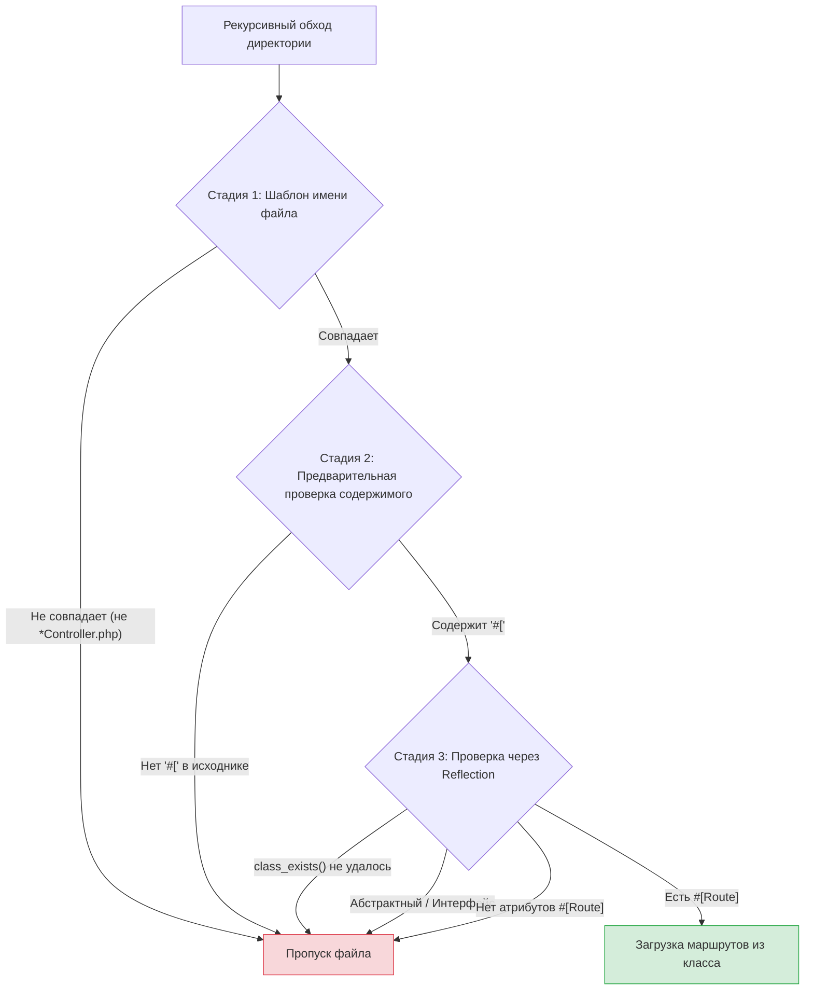
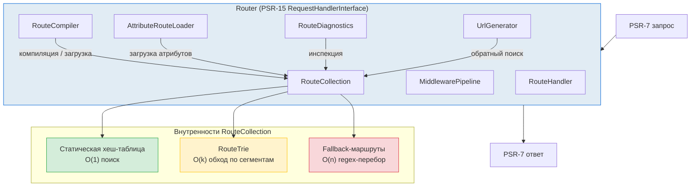

# Внутреннее устройство
{: .no_toc }

Алгоритмы, структуры данных и внутренняя архитектура Waypoint.
{: .fs-6 .fw-300 }

<details open markdown="block">
  <summary>Содержание</summary>
  {: .text-delta }
- TOC
{:toc}
</details>

---

## Жизненный цикл запроса

При вызове `Router::handle()` с входящим PSR-7 запросом выполняется следующая последовательность:



1. **Сопоставление маршрута** — `RouteCollection::match()` находит подходящий маршрут для HTTP-метода и URI.
2. **Конвейер middleware** — глобальные и маршрутные middleware выполняются в порядке FIFO.
3. **Вызов контроллера** — `RouteHandler` разрешает параметры через DI и вызывает контроллер.
4. **Ответ** — ответ поднимается обратно через стек middleware.

---

## Сопоставление маршрутов: трёхфазная стратегия

Waypoint использует трёхфазную стратегию сопоставления — от самого быстрого к самому медленному. Каждая фаза проверяется по порядку; как только совпадение найдено, поиск прекращается.



### Фаза 1: Статическая хеш-таблица — O(1)

Маршруты без параметров (например, `/about`, `/api/health`) хранятся в хеш-таблице с ключом `"METHOD:/path"`. Это обеспечивает поиск за константное время для самого распространённого случая.

```
GET:/about        → Route(pattern="/about", ...)
GET:/api/health   → Route(pattern="/api/health", ...)
POST:/api/users   → Route(pattern="/api/users", ...)
```

### Фаза 2: Prefix-Trie — O(k), где k = количество сегментов

Маршруты с параметрами (например, `/users/{id}`) хранятся в prefix-trie (дереве сегментов). Дерево обходится посегментно: для статических сегментов используется O(1) хеш-поиск, а regex применяется только для динамических сегментов.

### Фаза 3: Fallback Regex-перебор — O(n)

Маршруты с шаблонами, которые невозможно представить в trie (например, смешанные сегменты вроде `prefix-{name}.txt`), используют линейный regex-перебор. Эти маршруты группируются по первому сегменту URI для префиксной фильтрации, что сокращает количество regex-проверок.

---

## Алгоритм Prefix-Trie

`RouteTrie` — это дерево, где каждый узел представляет один сегмент URI. Дочерние узлы организованы как хеш-таблица (статические сегменты) плюс упорядоченный список (динамические сегменты).



### Алгоритм обхода Trie

```
function match(method, segments, depth, params, allowedMethods):
    if depth == len(segments):
        // Дошли до конца — проверяем листовые маршруты
        for each leaf route at this node:
            if route.allowsMethod(method):
                return {route, params}
            else:
                collect allowedMethods
        return null

    segment = segments[depth]

    // 1. Сначала статические дочерние узлы (O(1) хеш-поиск)
    if staticChildren[segment] exists:
        result = staticChildren[segment].match(method, segments, depth+1, params, allowedMethods)
        if result != null:
            return result

    // 2. Затем динамические дочерние узлы (regex-проверка на сегмент)
    for each dynamicChild:
        if dynamicChild.regex matches segment:
            params[dynamicChild.name] = segment
            result = dynamicChild.match(method, segments, depth+1, params, allowedMethods)
            if result != null:
                return result

    return null
```

**Ключевые свойства:**
- Статические сегменты разрешаются через O(1) хеш-поиск — без regex.
- Динамические сегменты проверяются только при неудаче статического поиска.
- Trie естественно учитывает приоритет: маршруты вставляются в порядке приоритета, и первое совпадение побеждает.
- Алгоритм обхода — в глубину (depth-first): каждая ветвь исследуется полностью перед возвратом.

---

## Конвейер Middleware

`MiddlewarePipeline` реализует PSR-15 `RequestHandlerInterface` и использует индексную итерацию (без клонирования):



### Алгоритм конвейера

```
class MiddlewarePipeline:
    middlewares: list
    handler: RequestHandlerInterface  // финальный обработчик (RouteHandler)
    index: int = 0

    function handle(request):
        if index >= len(middlewares):
            return handler.handle(request)  // вызов контроллера

        middleware = resolve(middlewares[index])
        index++
        try:
            return middleware.process(request, this)
        finally:
            index--  // восстановление для повторного использования
```

**Ключевые свойства:**
- **Порядок FIFO** — middleware выполняются в порядке регистрации.
- **Индексная итерация** — исключает клонирование объекта конвейера для каждого вызова middleware.
- **Блок `finally`** — гарантирует восстановление индекса после исключений или коротких замыканий, делая конвейер переиспользуемым.
- **Ленивое разрешение** — имена классов middleware разрешаются из PSR-11 контейнера только при необходимости; разрешённые экземпляры кэшируются.

---

## Внедрение зависимостей: разрешение параметров

`RouteHandler` разрешает параметры методов контроллера по двум стратегиям:



**Быстрый путь (кэш):** `RouteCompiler` предвычисляет план разрешения аргументов для каждого обработчика маршрута. Во время выполнения план — это простой массив записей `{source, name, cast, ...}` — Reflection не нужен.

**Медленный путь (runtime):** Когда план недоступен (например, для замыканий или некэшированных маршрутов), `RouteHandler` использует PHP Reflection для анализа параметров метода и их динамического разрешения.

### Приведение типов

Параметры маршрута (извлечённые из URI как строки) автоматически приводятся к объявленному скалярному типу:

| Объявленный тип | Приведение |
|:---------------|:-----------|
| `int` | `(int) $value` |
| `float` | `(float) $value` |
| `bool` | `filter_var($value, FILTER_VALIDATE_BOOLEAN)` |
| `string` | Без приведения (passthrough) |

---

## Кэширование маршрутов: конвейер компиляции

`RouteCompiler` преобразует коллекцию маршрутов в оптимизированный PHP-файл класса:



Сгенерированный класс реализует `CompiledMatcherInterface` со следующими ключевыми методами:

| Метод | Назначение |
|:------|:-----------|
| `matchStatic($method, $uri)` | O(1) поиск через PHP `match`-выражение |
| `matchDynamic($method, $uri, &$allowed)` | Сгенерированный код обхода trie |
| `staticMethods($uri)` | Сбор разрешённых методов для статических маршрутов |
| `isStaticOnly($uri)` | Проверка: есть ли у URI только статические маршруты (ранний 405) |
| `findByName($name)` | O(1) поиск имя -> индекс маршрута |
| `getRoute($index)` | Получение данных маршрута по индексу |
| `getRouteCount()` | Общее количество скомпилированных маршрутов |
| `getFallbackIndices()` | Индексы не-trie-совместимых маршрутов |

**Ключевые оптимизации:**
- **OPcache-совместимость** — файл представляет собой обычный PHP-класс, хранимый в разделяемой памяти.
- **Без Reflection** — планы разрешения аргументов предвычислены на этапе компиляции.
- **Ленивая гидратация** — объекты `Route` создаются только для совпавших маршрутов, а не для всех.
- **Match-выражения** — PHP 8 `match` используется для диспетчеризации статических маршрутов (компилируется движком в хеш-таблицу).

---

## Сканирование директорий: трёхстадийный фильтр

`AttributeRouteLoader::loadFromDirectory()` использует трёхстадийный фильтр для минимизации дорогих операций:



| Стадия | Стоимость | Что фильтрует |
|:-------|:----------|:--------------|
| **Шаблон имени** | Очень низкая (сравнение строк) | Файлы, не подходящие под glob (например, `*Controller.php`) |
| **Предварительная проверка** | Низкая (чтение файла + `str_contains`) | Файлы без синтаксиса PHP-атрибутов (`#[`) |
| **Проверка через Reflection** | Высокая (автозагрузка + reflection) | Абстрактные классы, интерфейсы, классы без `#[Route]` |

Каждая стадия дешевле следующей. Большинство файлов отфильтровываются на стадиях 1-2, поэтому дорогая автозагрузка и reflection выполняются только для файлов, которые скорее всего содержат маршруты.

---

## Обзор архитектуры



| Компонент | Ответственность |
|:----------|:----------------|
| **Router** | Точка входа — регистрация маршрутов, middleware, кэширование, диспетчеризация запросов |
| **RouteCollection** | Хранение маршрутов, сопоставление через трёхфазную стратегию |
| **RouteTrie** | Prefix-tree для быстрого посегментного сопоставления |
| **AttributeRouteLoader** | Чтение атрибутов `#[Route]` через Reflection |
| **MiddlewarePipeline** | Выполнение PSR-15 middleware в порядке FIFO |
| **RouteHandler** | Вызов методов контроллера с DI-разрешёнными параметрами |
| **UrlGenerator** | Обратная маршрутизация — генерация URL из именованных маршрутов |
| **RouteCompiler** | Компиляция маршрутов в PHP-класс для OPcache |
| **RouteDiagnostics** | Обнаружение конфликтов и формирование отчётов |
